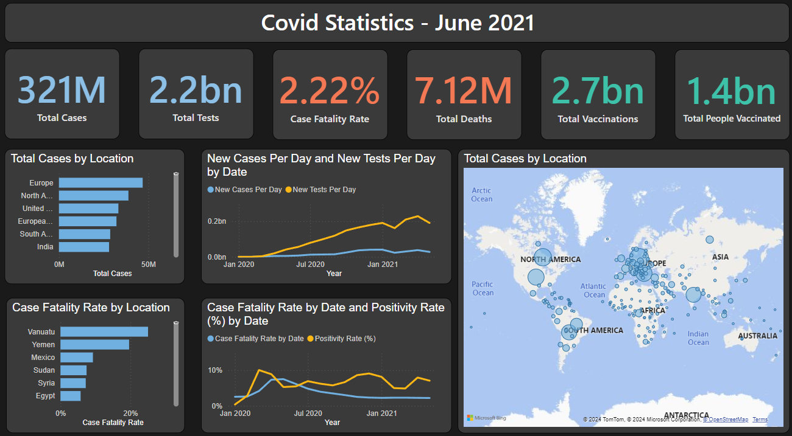

## Overview

The **Covid-19 Global Statistics Dashboard** provides an in-depth analysis of the global pandemic, focusing on key metrics such as total cases, total tests, deaths, vaccinations, and case fatality rates. The dashboard integrates data across various countries and time periods, delivering actionable insights and clear visualizations for better understanding the impact of the pandemic.

---

## **Key Metrics**

### **1. Global Covid-19 Statistics**  
- **Total Cases**: 321M  
- **Total Tests**: 2.2bn  
- **Case Fatality Rate**: 2.22%  
- **Total Deaths**: 7.12M  
- **Total Vaccinations**: 2.7bn  
- **Total People Vaccinated**: 1.4bn  

These KPIs (Key Performance Indicators) summarize the overall spread, testing, and response to the pandemic.

---

## **Visualizations**

### **2. Total Cases by Location**  
- **Regional Distribution**:  
   - Europe and North America lead with the highest total cases, followed closely by South America and Asia.  
   - Countries like **India** and **the United States** are prominently represented as significant contributors to the total cases.  

### **3. Testing and Cases Distribution**  
- **Total Cases by Location**:  
   - The map highlights the **global distribution** of Covid-19 cases with bubble sizes proportional to the total cases in each region.  
   - Major clusters are evident in **North America** and **Europe**, reflecting high case concentrations.  
   - Smaller bubbles across **Asia**, **Africa**, and **South America** indicate varying case volumes across these regions.  
   - **Australia** shows relatively fewer cases, with smaller bubble sizes.  
- The map effectively illustrates **geographical hotspots** of the pandemic and their global spread.  

<!--  -->

---

### **4. New Cases and Testing Trends**  
- **New Cases Per Day** vs. **New Tests Per Day**:  
   - A clear upward trend in new cases and testing is visible between **2020 and 2021**, with peak testing rates observed towards the end of the timeline.  
   - This visualization helps analyze the effectiveness of testing relative to case detection.

---

### **5. Case Fatality Rate by Location**  
- Countries like **Vanuatu**, **Yemen**, and **Mexico** report higher case fatality rates, indicating challenges in healthcare systems or delays in treatment.

---

### **6. Case Fatality Rate (%) and Positivity Rate (%) by Date**  
- A time-based analysis of fatality and positivity rates reveals spikes during significant waves of the pandemic.  
- **Positivity Rate**: Measures the percentage of positive tests over total tests conducted, offering insights into testing adequacy during peak times.

---

## Insights and Analysis

1. **Global Spread**: Europe and North America emerge as primary regions with the highest total cases, while other regions also contribute significant case volumes.  
2. **Testing and Detection**: Increased testing over time correlates with improved case detection, yet positivity rates highlight gaps during peak waves.  
3. **Case Fatality Variations**: Fatality rates vary across locations, suggesting disparities in healthcare infrastructure and response effectiveness.  
4. **Vaccinations and Recovery**: Vaccination programs reflect progress in combating the pandemic, with a large percentage of the population vaccinated globally.  

---

## Tools and Technologies

The analysis was conducted using a combination of the following tools:
- **Data Storage**: MySQL for managing Covid-19 datasets.  
- **Data Analysis**: Python libraries like Pandas and Matplotlib for data cleaning, manipulation, and visualization.  
- **Business Intelligence**: Power BI for creating interactive dashboards and visualizations to track KPIs.  

---

[Click Here to View the Live Dashboard](https://mavenanalytics.io/project/23390)

## Conclusion

The Covid-19 Global Statistics Dashboard offers a comprehensive view of the pandemic’s impact worldwide. By analyzing key metrics, testing trends, and case fatality rates, the dashboard helps identify regional patterns and gaps in response strategies.
